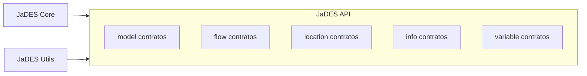

# JaDES API - Diagramas

## Vista de contratos

```mermaid
flowchart LR
  subgraph API[JaDES API]
    model[model contratos]
    flow[flow contratos]
    location[location contratos]
    info[info contratos]
    variable[variable contratos]
  end

  core[JaDES Core]
  utils[JaDES Utils]

  core --> API
  utils --> API
```
